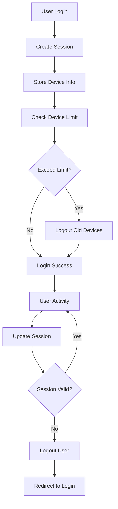

# 🔐 Hệ thống Authentication Quản lý Thiết bị

## 📋 Tổng quan

Hệ thống Authentication tùy chỉnh cho phép quản lý đăng nhập, đăng xuất từ các thiết bị khác nhau với các tính năng:

- ✅ **Theo dõi thiết bị**: Quản lý tất cả thiết bị đã đăng nhập
- ✅ **Đăng xuất từ xa**: Đăng xuất từ thiết bị cụ thể hoặc tất cả thiết bị
- ✅ **Giới hạn thiết bị**: Kiểm soát số lượng thiết bị đăng nhập cùng lúc
- ✅ **Bảo mật session**: Quản lý session an toàn với thời gian hết hạn
- ✅ **Thống kê chi tiết**: Báo cáo hoạt động đăng nhập

## 🏗️ Kiến trúc hệ thống

### **Models**
- `UserSession` - Quản lý thông tin session thiết bị
- `User` - Mở rộng với quan hệ sessions

### **Services**
- `DeviceAuthenticationService` - Logic xử lý authentication thiết bị

### **Controllers**
- `DeviceAuthController` - API endpoints cho quản lý thiết bị

### **Middleware**
- `DeviceSessionMiddleware` - Kiểm tra và cập nhật session

### **Commands**
- `CleanupExpiredSessions` - Dọn dẹp session hết hạn

## 📦 Cài đặt

### **1. Cài đặt dependencies**
```bash
composer require jenssegers/agent
```

### **2. Chạy migration**
```bash
php artisan migrate
```

### **3. Đăng ký middleware**
Middleware đã được đăng ký trong `app/Http/Kernel.php`:
```php
'device.session' => \App\Http\Middleware\DeviceSessionMiddleware::class,
```

### **4. Cấu hình**
Cập nhật file `.env`:
```env
# Device Authentication Settings
AUTH_MAX_DEVICES=5
SESSION_LIFETIME=120
SESSION_IDLE_TIMEOUT=30
AUTH_ALLOW_MULTIPLE_SAME_DEVICE=true
AUTH_AUTO_LOGOUT_OLD_DEVICES=true
AUTH_LOG_LOGIN_ACTIVITY=true

# Security Settings
AUTH_BRUTE_FORCE_PROTECTION=true
AUTH_MAX_LOGIN_ATTEMPTS=5
AUTH_LOCKOUT_DURATION=15
AUTH_NOTIFY_NEW_DEVICE=true

# Cleanup Settings
AUTH_AUTO_CLEANUP_EXPIRED=true
AUTH_KEEP_LOGOUT_SESSIONS=30
```

## 🚀 Sử dụng

### **1. Đăng nhập với Device Tracking**
```php
use App\Services\DeviceAuthenticationService;

$deviceAuth = app(DeviceAuthenticationService::class);

// Đăng nhập
$result = $deviceAuth->login($request, [
    'email' => 'user@example.com',
    'password' => 'password'
], $remember = false);

if ($result['success']) {
    // Đăng nhập thành công
    $session = $result['session'];
    $deviceInfo = $result['device_info'];
}
```

### **2. Quản lý thiết bị**
```php
// Lấy danh sách thiết bị đang hoạt động
$devices = $deviceAuth->getActiveDevices($user);

// Đăng xuất từ thiết bị cụ thể
$result = $deviceAuth->logoutFromDevice($user, $sessionToken);

// Đăng xuất từ tất cả thiết bị khác
$result = $deviceAuth->logoutFromOtherDevices($user, $currentSessionToken);

// Đăng xuất từ tất cả thiết bị
$result = $deviceAuth->logoutFromAllDevices($user);
```

### **3. Kiểm tra session**
```php
// Kiểm tra session có hợp lệ không
$isValid = $deviceAuth->validateSession($request);

// Cập nhật hoạt động session
$deviceAuth->updateActivity($request);

// Lấy thống kê thiết bị
$statistics = $deviceAuth->getDeviceStatistics($user);
```

## 🎨 Frontend Integration

### **1. Trang quản lý thiết bị**
```blade
@extends('layouts.app')

@section('content')
<div class="container">
    <h1>Quản lý thiết bị</h1>
    
    <!-- Statistics Cards -->
    <div class="row mb-4">
        <div class="col-md-3">
            <div class="card">
                <div class="card-body">
                    <h5>Tổng thiết bị</h5>
                    <h2>{{ $statistics['total_sessions'] }}</h2>
                </div>
            </div>
        </div>
        <!-- More cards... -->
    </div>
    
    <!-- Devices List -->
    <div class="card">
        <div class="card-header">
            <h5>Thiết bị đang đăng nhập</h5>
        </div>
        <div class="card-body">
            @foreach($devices as $device)
            <div class="device-item">
                <div class="d-flex justify-content-between">
                    <div>
                        <h6>{{ $device['device_info'] }}</h6>
                        <small>{{ $device['ip_address'] }} • {{ $device['last_activity'] }}</small>
                    </div>
                    @if(!$device['is_current'])
                    <button onclick="logoutDevice('{{ $device['session_token'] }}')" 
                            class="btn btn-sm btn-danger">
                        Đăng xuất
                    </button>
                    @endif
                </div>
            </div>
            @endforeach
        </div>
    </div>
</div>
@endsection
```

### **2. JavaScript functions**
```javascript
// Đăng xuất thiết bị cụ thể
async function logoutDevice(sessionToken) {
    const response = await fetch('/auth/devices/logout-device', {
        method: 'POST',
        headers: {
            'Content-Type': 'application/json',
            'X-CSRF-TOKEN': document.querySelector('meta[name="csrf-token"]').content
        },
        body: JSON.stringify({ session_token: sessionToken })
    });
    
    const result = await response.json();
    if (result.success) {
        location.reload();
    }
}

// Đăng xuất tất cả thiết bị khác
async function logoutOtherDevices() {
    const response = await fetch('/auth/devices/logout-other', {
        method: 'POST',
        headers: {
            'X-CSRF-TOKEN': document.querySelector('meta[name="csrf-token"]').content
        }
    });
    
    const result = await response.json();
    if (result.success) {
        location.reload();
    }
}
```

## 🛡️ Bảo mật

### **1. Session Security**
- Session token được tạo ngẫu nhiên 60 ký tự
- Cookies được cấu hình với `HttpOnly`, `Secure`, `SameSite`
- Thời gian hết hạn session có thể cấu hình
- Tự động gia hạn session khi có hoạt động

### **2. Device Fingerprinting**
- Tạo device ID duy nhất từ User-Agent và IP
- Theo dõi thông tin thiết bị chi tiết
- Phát hiện thiết bị mới và thông báo

### **3. Brute Force Protection**
- Giới hạn số lần đăng nhập sai
- Khóa tài khoản tạm thời khi vượt quá
- Ghi log tất cả hoạt động đăng nhập

## 📊 API Endpoints

### **Authentication**
```
POST /auth/login              - Đăng nhập với device tracking
POST /auth/logout             - Đăng xuất thiết bị hiện tại
```

### **Device Management**
```
GET  /auth/devices            - Trang quản lý thiết bị
GET  /auth/devices/active     - Lấy danh sách thiết bị hoạt động
POST /auth/devices/logout-device - Đăng xuất thiết bị cụ thể
POST /auth/devices/logout-other  - Đăng xuất thiết bị khác
POST /auth/devices/logout-all    - Đăng xuất tất cả thiết bị
GET  /auth/devices/statistics    - Lấy thống kê thiết bị
POST /auth/devices/update-activity - Cập nhật hoạt động
GET  /auth/devices/check-session   - Kiểm tra session
POST /auth/devices/refresh-session - Làm mới session
```

## 🔧 Commands

### **Dọn dẹp session hết hạn**
```bash
# Dọn dẹp session hết hạn
php artisan sessions:cleanup

# Dọn dẹp với tùy chọn
php artisan sessions:cleanup --days=30 --force

# Lên lịch tự động (trong app/Console/Kernel.php)
$schedule->command('sessions:cleanup')->daily();
```

## 📈 Monitoring & Analytics

### **1. Thống kê thiết bị**
```php
$statistics = $deviceAuth->getDeviceStatistics($user);
// Returns:
// - total_sessions: Tổng số session
// - active_sessions: Session đang hoạt động
// - device_types: Phân bố theo loại thiết bị
// - recent_logins: Đăng nhập gần đây
// - unique_ips: Số IP duy nhất
```

### **2. Activity Logs**
```php
// Ghi log hoạt động đăng nhập
Log::info('User login', [
    'user_id' => $user->id,
    'device_type' => $deviceInfo['device_type'],
    'ip_address' => $request->ip(),
    'user_agent' => $request->userAgent()
]);
```

## 🎯 Best Practices

### **1. Security**
- Luôn sử dụng HTTPS trong production
- Cấu hình session timeout phù hợp
- Thường xuyên dọn dẹp session hết hạn
- Giám sát hoạt động đăng nhập bất thường

### **2. Performance**
- Sử dụng index database cho các truy vấn thường xuyên
- Cache thông tin thiết bị khi cần thiết
- Giới hạn số lượng session lưu trữ

### **3. User Experience**
- Thông báo rõ ràng khi đăng xuất từ thiết bị khác
- Hiển thị thông tin thiết bị dễ hiểu
- Cung cấp tùy chọn "Nhớ đăng nhập"

## 🔄 Workflow



## 🚀 Tính năng nâng cao

### **1. GeoIP Integration**
```php
// Cấu hình GeoIP service
'device_detection' => [
    'use_geoip' => true,
    'geoip_service' => 'maxmind',
],
```

### **2. 2FA cho thiết bị mới**
```php
// Yêu cầu 2FA khi đăng nhập từ thiết bị mới
'security' => [
    'require_2fa_new_device' => true,
],
```

### **3. Email notifications**
```php
// Gửi email thông báo đăng nhập mới
'security' => [
    'notify_new_device_login' => true,
    'notify_suspicious_login' => true,
],
```

---

**Hệ thống Device Authentication này cung cấp giải pháp toàn diện cho việc quản lý đăng nhập từ nhiều thiết bị với bảo mật cao và trải nghiệm người dùng tốt!** 🎉
